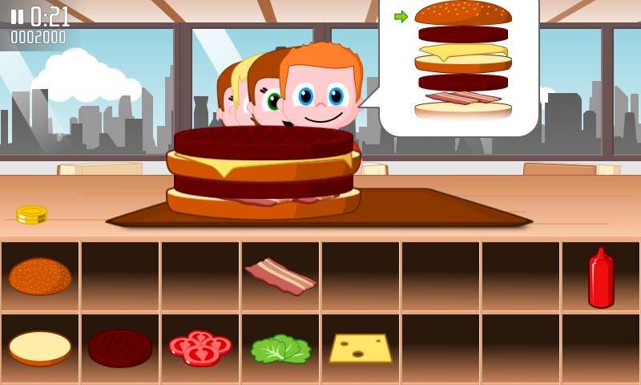

public: true
pub_date: 2023-05-24 07:59:42 +01:00
tags: [burgerparty]
title: Return of the burger, Burger Party 1.4 is out!

A few years ago, I published my first Android game: [Burger Party][bp]. Not the game of the year, but it was good fun!

Google recently notified Android developers it was going to remove apps targeting too old SDK versions from Google Play, so I dived in and refreshed Burger Party source code.

<!-- break -->

The upgrades have been significant:

- libgdx: 0.9.9 → 1.10.0
- Android SDK: 26 → 33
- Java: 1.6 → 11
- Gradle: 3.3 → 7.3.3
- Android Gradle Project: 2.3.3 → 7.2

Of course, it's already outdated at the time you read this... such is the way of Android development 😅. What matters is that Google Play likes it again!

## Other changes

Apart from these upgrades, the game received a few other changes:

First, it's now available in Dutch and Polish, thanks to Heimen Stoffels and Marek Szumny 🙏.

The Polish translation was a bit more work than expected, as I found myself once again adding missing glyphs to the font used by the game. Once that was done I had to figure out the asset flow used to turn the .ttf font into files usable by Burger Party... lack of documentation bit me hard there... I eventually fixed that *and* documented it. That should help future-me when another upgrade becomes necessary!

Second, I added an end sequence! As I wrote in my [April update](../2023-04-update), there were sketches for an end sequence in the repository but at the time I drew them I just wanted to be done with the game and did not integrate them. That's why you only got a "Congratulations, you finished the game!" placeholder message. The game now features a short animation when you finish it, I hope players enjoy it.

## And now?

The game is available for download from [Google Play][gp] and from its [project page][bp]. Now I am going to look into adding it to F-Droid!

Oh and if you like it, you can buy [Burger Party goodies][goodies]!

[gp]: https://play.google.com/store/apps/details?id=com.agateau.burgerparty
[bp]: /projects/burgerparty
[goodies]: /redirect/bp-goodies
