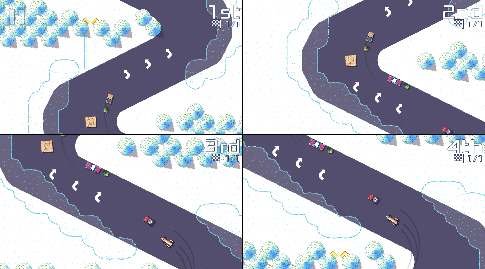

public: true
pub_date: 2023-04-25 08:46:06 +01:00
tags: [pixelwheels, split-screen]
title: Split-screen revival progress

As I explained in my [previous status update][march-update], I decided not to dive into LAN based multi-player for Pixel Wheels. Instead I am reworking the existing shared screen multi-player mode. It's going to use split screen again and support up to 4 players.

[march-update]: ../2023-03-update/

## Showing more players

I am making good progress so far. The game engine is now capable of showing 4 players:

This is not finished though: (more than) half of the battle is reworking the game screens to accommodate up to four players. The above screenshot is a bit misleading: the game engine shows 4 racers, but not all of them are controlled by players yet.

## Vehicle selection

One of the challenging parts of this work was the vehicle selection. Until now, in multi-player mode, Pixel Wheels have been showing one vehicle list per player, like this:

That design does not scale to 4 players: 4 vehicle lists would not fit on the same screen, and even if they did, it would look very cramped. Taking some inspiration from Mario Kart, I reworked this screen to use a shared vehicle list, where each player controls its own selection.

This was tricky to achieve because the code for this selector was not created with multiple players in mind 😅. After much refactoring, I managed to pull this off. It now looks like this:

The screenshot shows only 2 players, but it should scale to 4 players without issues.

<!-- break -->

## Not done yet

There is still some work to do before 4-player split-screen is ready though.

First, I need to add a way to select the number of players. This should be easy.

Second, I need to rework the configuration screen to allow configuring the controls for 4 players. I expect that one to be challenging. As you can see in the screenshot below, the current UI does not scale to 4 players, and the UI code currently does not support scrolling pages...

These are the next challenges, once I am done with it, 4-player split-screen should be good to go!
