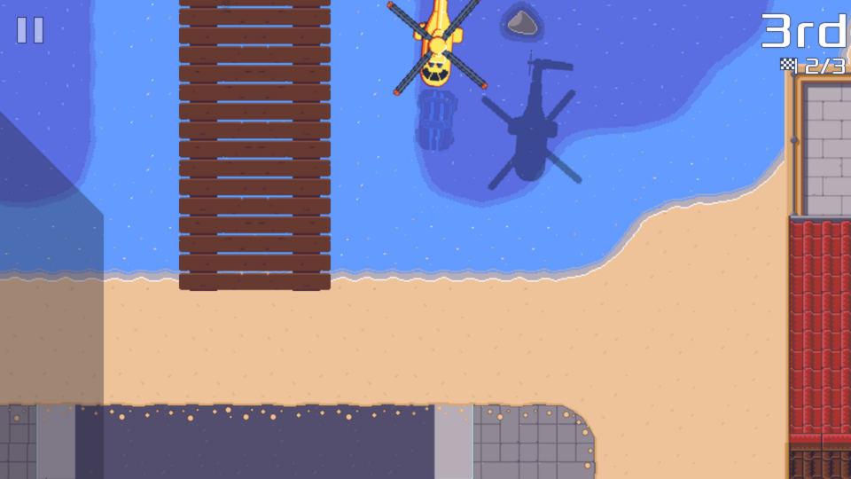

Following my [2023 wrap up][], here is the first status update where I focus on a single topic for the month, with the hope of making the update a more enjoyable read.

[2023 wrap up]: ../2023-wrap-up/

This month I finished [Pixel Wheels][] new track: "The island".

The track starts with a tight right turn around a tower.

Then you drive in front of an old fortified entrance:

<!-- break -->

Turn around another tower, hit the turbo tiles to take advantage of the straight line:

Next is a wide turn, before reaching the tricky part...

The boardwalk over water section!

You might want to go fast, like this Miramar...

But do not overdo it!

As I said, do not go too fast, unless you want to say hello to the rescue helicopter.

After this part you head to the center of the town.

Careful with the trees: it's easy to get stuck between them!

Now you can take the shortcut to the end of the track.

[Pixel Wheels]: /projects/pixelwheels
