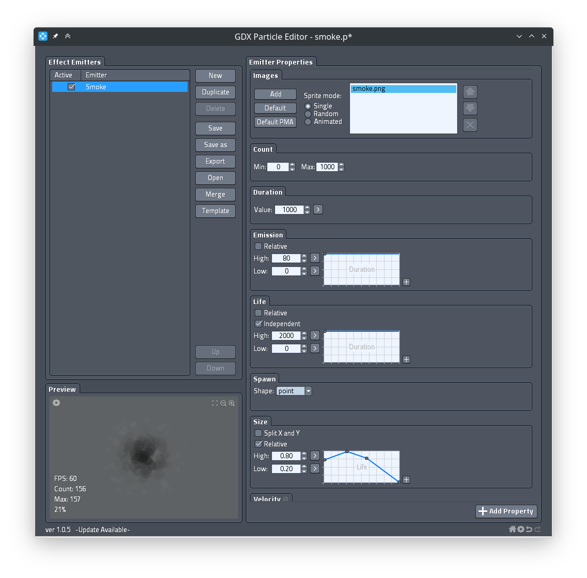
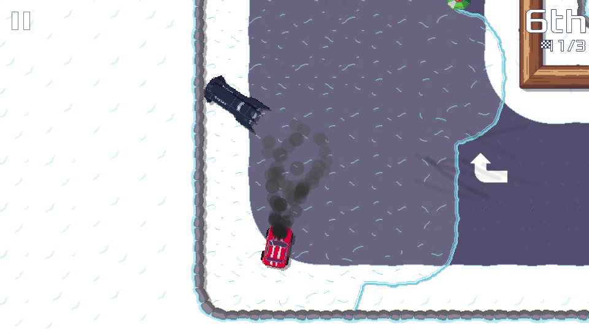
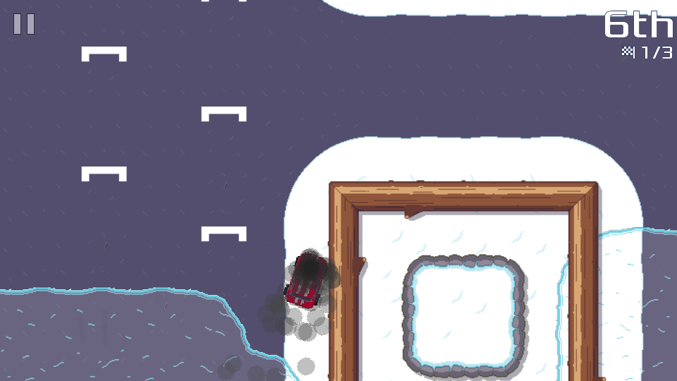

For this February status update,  I want to show the work I have been doing on Pixel Wheels "hit effect". The "hit effect" is what happens when a vehicle is hit by a gun bullet, a missile, or triggers a mine.

Up to know when this happens, the vehicle makes a 360°, which slows him down but keeps it in the same direction as it was before getting hit. This effect has two issues though:

1. When the vehicle is hit close to a wall, the effect is canceled as soon the vehicle touches the wall. This means some time the vehicle is almost not slowed down.
2. On the other hand, the effect is too punishing when hit by bullets, because each bullet hit triggers another 360° and each bullet hit pushes the vehicle a bit further. If you are unlucky, you can end up stuck in the middle of a forest. This is what happened to the reporter of bug [#418](https://github.com/agateau/pixelwheels/issues/418).

So the effect can be either not punishing enough or too punishing 🙃.

<!-- break -->

To remedy that, I replaced this 360° effect with a slow down, as if your vehicle motor temporarily shutdown. This solves both issues. In the case of multiple bullet hits from the gun, the slow down duration is reset by each hit, so getting hit twice or more is still more penalizing than getting hit only once, but it does not push your vehicle anymore, so you won't end up stuck in a forest.

Visually this looked a bit underwhelming though. I first made the vehicle go black and slowly get back to normal when the slow down effect ended, but that was not really spectacular. This was the perfect opportunity to play with a game element I have never used before: particles!

Using [GDX Particle Editor](https://libgdx.com/wiki/tools/2d-particle-editor), I put together a smoke effect:

Playing with the editor was a lot of fun, I am quite happy with the result. Here is what it looks like in game:

And here is a short video showing it in action:

<video width="960" height="540" controls>
    <source src="smoke-effect.mp4">
</video>

That's it for this update, let me know what you think of this new effect! You can try it from the [latest builds](https://builds.agateau.com/pixelwheels).