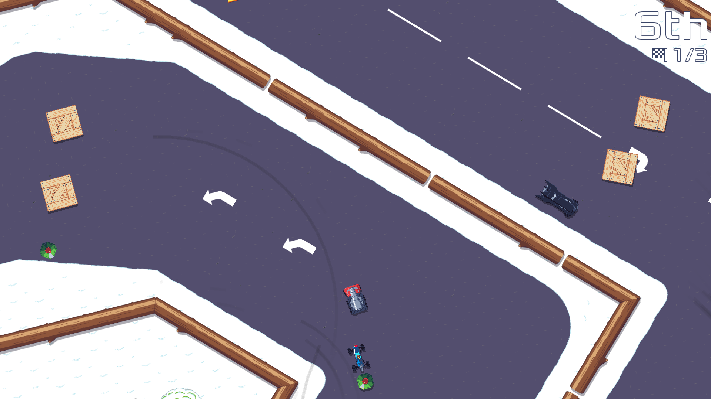

## Introduction

Another 2-months-at-a-time update because real-world life kept me really busy lately. This report will be about Pixel Wheels again.

## The rotating camera is back!

Pixel Wheels camera initially rotated so that the player vehicle was always pointing to the top of the screen. This way you never pressed Left when you actually wanted to go right but the vehicle was pointing down.

I was a big fan of this behavior, but others were not: it can make players a bit dizzy. It first became an option, but eventually got removed because it clashed with a rework of the multiplayer mode where all players shared the same screen.

This multiplayer mode change [eventually got reverted][splitscreen], so the rotating camera could be brought back. Except I did not have the energy to do so. This is where contributor Compl Yue stepped in: he re-implemented the rotating camera mode, bringing this feature back from the dead.

<!-- break -->

The only problem with it (which was already present in the first incarnation of this option) was the rendering of the map when the view of the game world includes areas outside the map boundaries. It would end up looking like that:

My plan for this was to modify the map renderer to fill the empty areas with tiles from the borders of the map. I would add map properties to tell the renderer how many rows and columns to repeat, for each edge.

I initially dreaded diving into the implementation as I expected it would be difficult to convince libGDX tiled map renderer to do that, but it turned out to be not too difficult. I just had to accept to duplicate a small part of libGDX code inside Pixel Wheels code, because the required changes could not be done in any other way.

With the renderer changes in, all that was left was to actually modify the maps to make sure borders could be repeated seamlessly.

[splitscreen]: https://agateau.com/2023/split-screen-revival-progress/

## Bug Fixes

Compl Yue also fixed an [annoying bug][heli-bug] where the helicopter sound would keep playing back forever. Thanks again!

[heli-bug]: https://github.com/agateau/pixelwheels/pull/439

## What's next

Before releasing the next version of Pixel Wheels, I want to finish setting up some Pixel Wheels goodies to sell on Redbubble. I also have a bunch of other overdue releases to make: one for Burger Party, one for Clyde, and maybe one for SFXR-Qt!
