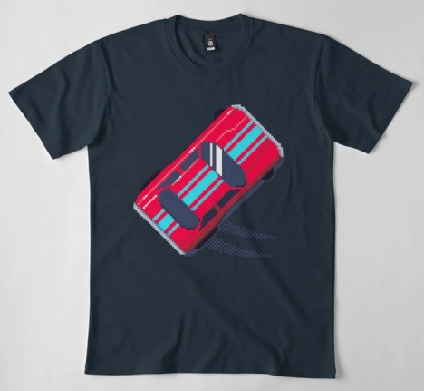
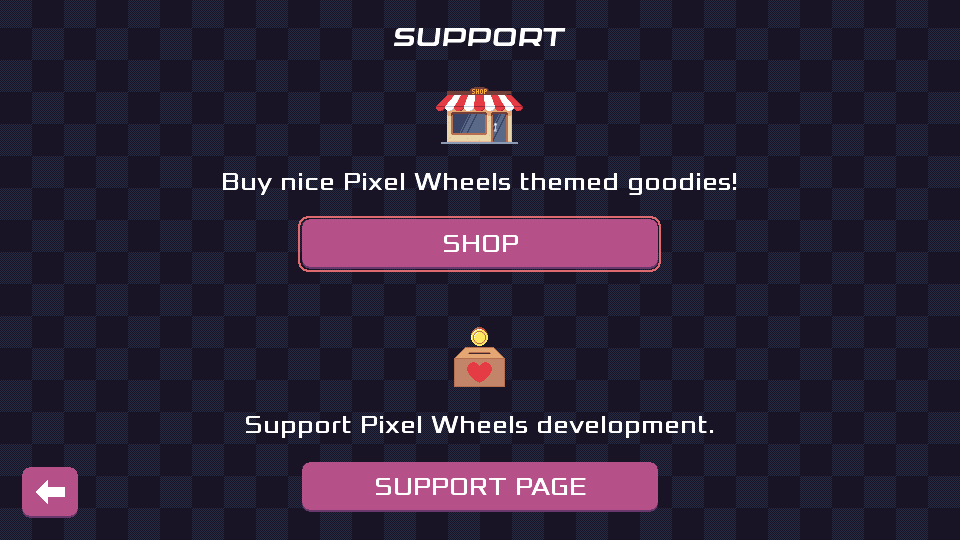

## Introduction

So, in my last status update I said there would probably be a Pixel Wheels release in July and... it did not happen. Vacations and planned surgery did not help making this month super productive 😁. I nevertheless made some progress on Pixel Wheels. Let's get through them.

## Galician translation

First, Pixel Wheels received a new translation, this time it's Galician, by Ninjum. Thanks!

## Merchandising

Pixel Wheels is getting some merchandising! I created a [Pixel Wheels collection on RedBubble][redbubble]. In great dogfooding tradition, I am probably going to order a T-shirt or a cap at some point 😉.

[redbubble]: https://www.redbubble.com/people/agateau/collections/4022553-pixel-wheels

<!-- break -->

## Support button

Having merch is good. Making it easy to find is even better. To help with this I reworked the main menu to include a SUPPORT button. Clicking this button opens a screen where you can either go buy said merch, or support me in other ways. Except if you get Pixel Wheels from Google Play: in this case the bottom half of the screen is empty, because [Google does not like support links...][support] (No, I am not bitter. No. Stop asking now, please).

[support]: ../../2021/google-does-not-want-you-to-tell-your-players-about-your-donation-page/

## Polishing

Other than that, I made some minor UI tweaks here and there, thickening focus rectangles, making spacing more consistent, that kind of polish.

## Asetools

Finally, Pixel Wheels produced a spin-off! This needs a bit more details.

All graphics in the game are created using [Aseprite][]. Aseprite uses its own native file format (ASE) to store images, but ASE files are not directly usable by the game, they need to be turned into PNG files.

Because I prefer not committing generated files, the PNGs are generated by the build system. The build system used to do this with Aseprite CLI, but Aseprite license is not OSI compliant, making it complicated to deploy on CI and on F-Droid build server.

To work around that, Pixel Wheels source tree has long contained a Python CLI tool called Asetools, whose job is to turn ASE files into PNG. Since I expect I am going to need something similar in my next game, I took some time to turn Asetools into its [own Python package][asetools-pypi] which you can now install with `pipx install asetools`. Who knows, maybe you find it useful too?

Note however that it was developed for Pixel Wheels, so it's very much tuned to the way I use Aseprite. Contributions to fix limitations (or any other issues) are most welcome!

[Aseprite]: https://aseprite.com
[asetools-pypi]: https://pypi.org/project/asetools

## What's next?

I am still ironing out a few issues, but the remaining list is getting short, so I am hopeful there will be a new Pixel Wheels release in August 🤞.
