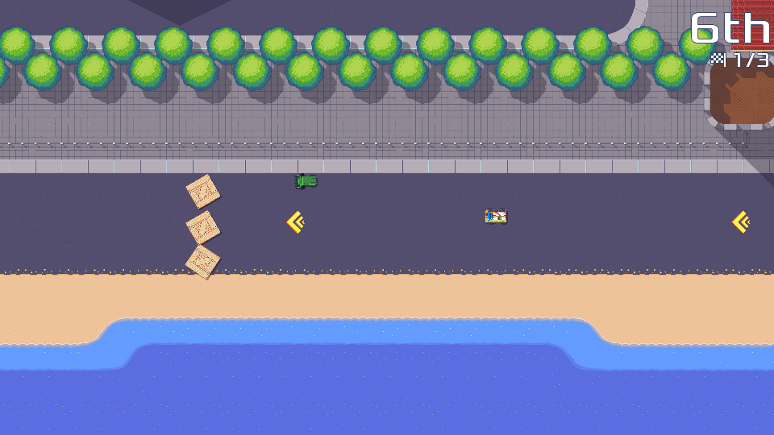

## Release or not?

So, has the new version of Pixel Wheels been released? Well... not yet... but it's almost there! Translators have updated their translations (thanks!), I did a few adjustments and a bunch of testing. It looks good so far.

## Final adjustments

### UI tweaks

The addition of the Island track made the track selector in the "Quick Race" screen too cramped. A few months ago I redesigned it to use a primary-secondary layout: first row shows the championship, second row shows the tracks in the currently selected championship. This scales much better, but touch mode was a bit broken: one had to "double-touch" on a championship to see its tracks, so I fixed that.

I now understand why lists in many mobile games only show one item at a time, with previous / next buttons to navigate. It's not super efficient, but it makes it possible to show an item *and* details about it, which is difficult in a UI without notion of cursor hovering or focus.

### Island adjustments

"The Island" received a few final touches: I defined track records for it, but while driving it other and other I realized the long straight line at the bottom was a bit boring, so I added some extra turbo tiles to spruce it up.

<!-- break -->

I also felt like the [BRGP42][] and [Rocket][], being fast vehicles, should be faster! I increased their maximum speed a bit.

[BRGP42]: /projects/pixelwheels/vehicles/#brgp42
[Rocket]: /projects/pixelwheels/vehicles/#rocket

## What's next?

At the time I am writing this (early September), the new version has been uploaded to Google Play. I am now waiting for Google to bless my upload. Then I can continue with the release. Can't complain too much about this blessing step, though: it has caught bugs in the past 😅. Just have to keep my fingers crossed.
