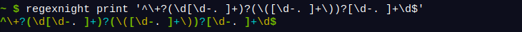
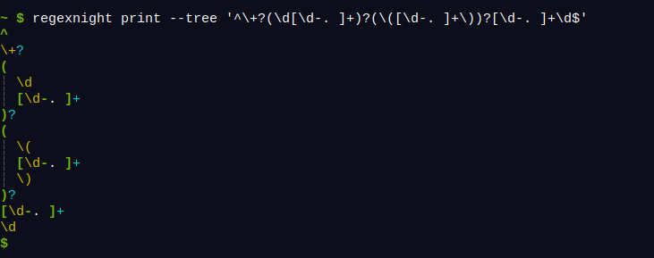
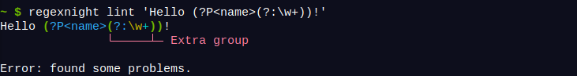

## Introduction

I planned to continue working on Pixel Wheels last month, but I needed a break. And I was looking for an excuse to continue learning Rust. At work I spend a lot of time on some quite hairy Python regular expressions, that sounded like a perfect opportunity: let's write a regular expression syntax highlighter and linter!

Yes, looks like I started yet another project.

Cranking my geek-dad joke level to 11, I called this tool... Regex Night :)

<!-- break -->

## What does this tool do?

Regex Night can do 3 things.

First, it can print a syntax-highlighted version of a regular expression:

Second, it can print this regular expression as a tree:

Third, it can report problems in a regular expression:

Version 0.1.0 can only report unnecessary groups. The upcoming 0.2.0 can also report unnecessarily escaped characters.

You can find Regex Night on its [GitLab page](https://gitlab.com/agateau/regexnight).

I am experimenting with GitLab these days, evaluating what I would miss if I were to move projects away from GitHub. So far the biggest limitation I have encountered is the lack of Windows and macOS runners in the CI. It looks like [`cross`](https://github.com/cross-rs/cross) can build Windows binaries, but that is not legally possible for macOS (not surprised by that). Other than that it feels pretty good.

## What's next?

After this "break", I am going to resume work on Pixel Wheels. Probably 😁.
