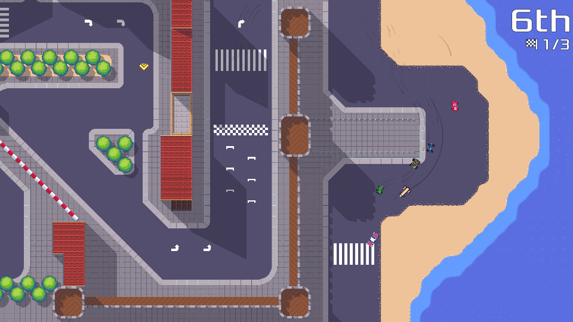
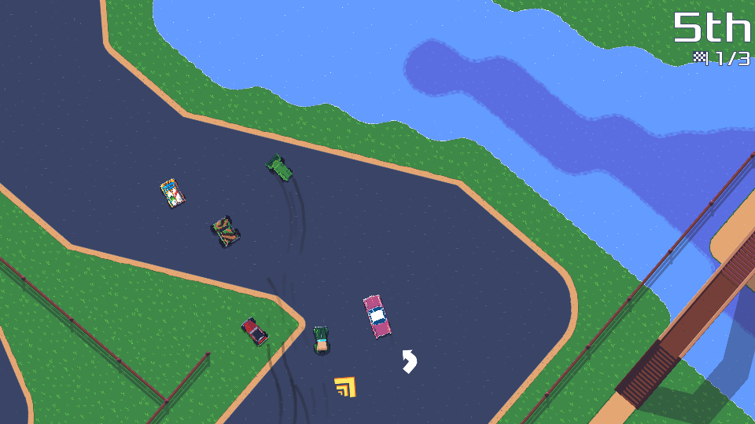
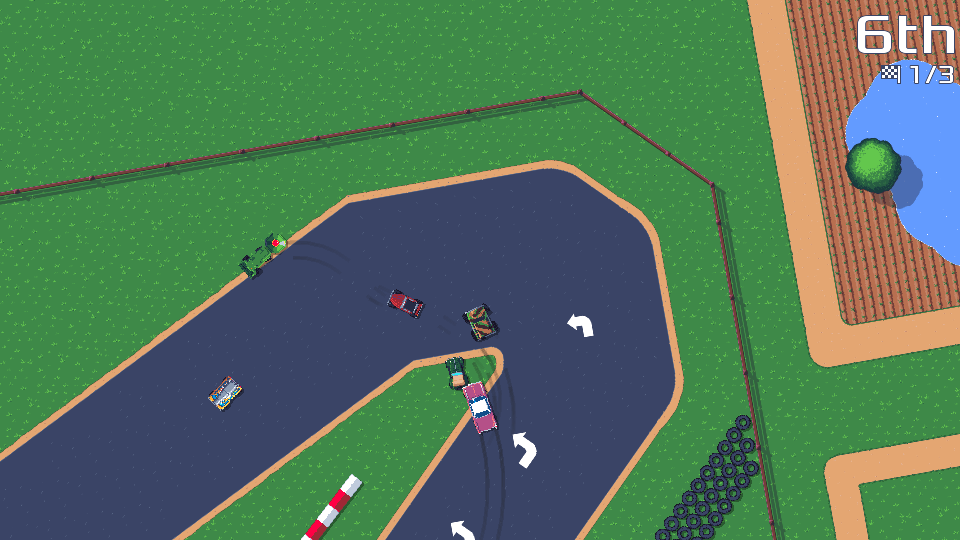
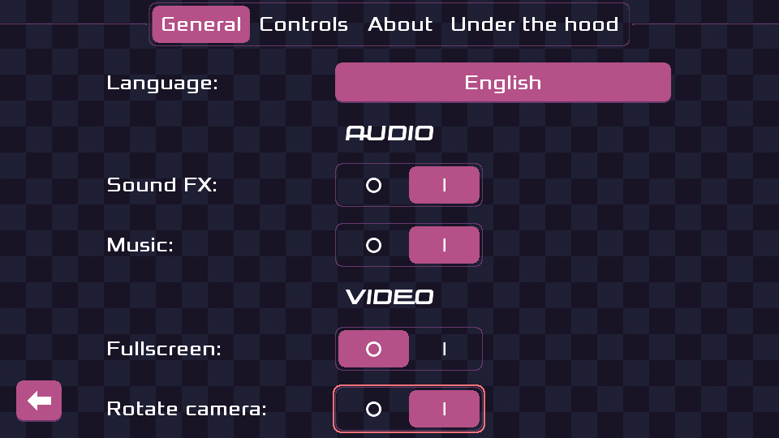
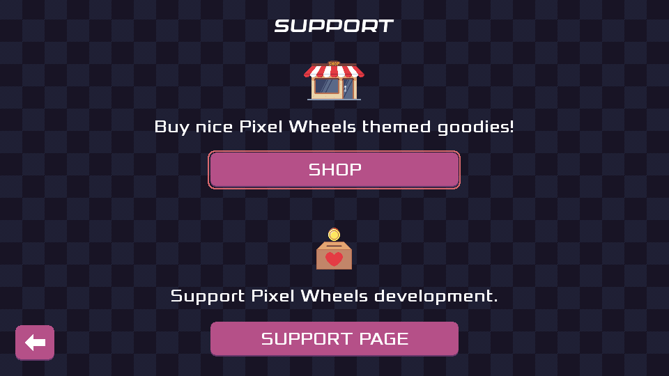

## Finally

It's here, Pixel Wheels 0.26.0 is [available for download](/projects/pixelwheels)!

## Major changes

If you have been following my status updates, none of this will be new to you, but here is a summary of the major changes brought by this new version.

### New track: "The Island"

The "Pix Cities" championship has its third track. This track is called "The Island" and take place on... an island, you guessed it.
It's a long track where you get to race along the walls of an ancient castle and on a narrow boardwalk with water on both sides. Careful!

_(Note that these are zoomed out screenshots, vehicles do not look that small when playing!)_

The addition of this track means all championships now have 3 tracks. This is an important milestone for me because this is one of my 1.0.0 requirements.

<!-- break -->

### Less punishing weapons

Until now, getting hit by a missile, a gun bullet or driving over a mine would cause your vehicle to do a 360° spin. This could be quite punishing, especially when hit by a gun bullet, because gun bullets do not travel alone, so it was quite common to get hit by five or six bullets, sending your vehicle far-far away, maybe even shove it in a small holes between trees.

This was frustrating, so I decided to change this. Now when you get hit, your vehicle is no longer pushed away, instead it starts emitting thick smock, becomes black and its engine stops for a while. This significantly slows you down but it's easier to recover from it.

<video width="960" height="540" controls>
    <source src="../2024-02-update/smoke-effect.mp4">
</video>

### Rotate that camera!

0.26.0 marks the return of the "rotate camera" mode. In this mode the vehicle always faces the top of the screen. When you turn, the whole world turns. It's a very polarizing feature: some prefer racing this way because you can never confuse your left from your right, others find the screen rotation feature nauseating... Maybe I should add a warning :)

This camera mode has an interesting history.

It was the default way to play Pixel Wheels until version 0.10.0. In 0.10.0 the fixed camera became the default mode. In 0.12.0 the rotate camera option was removed because I had changed the multi-player mode so that all players shared the same screen.

That multi-player shared screen mode turned out to be a not-so-good idea for various reasons, so in 0.25.0 multi-player was changed back to use a split-screen again (and gained support for up to 4 players).

It made sense to bring back the rotating camera mode, but I got used to the fixed mode and decided to focus on other topics. This is where Compl Yue stepped in: he did the bulk of the work to bring back the rotate camera mode. All I had to do was make sure we filled the empty areas around the map when driving close to the edges, and plug it in the UI.

Thanks a lot Compl Yue for this work, and for the other fixes you made to the game.

### Translation updates

In 0.26.0, Pixel Wheels learned to speak Galician, thanks to Ninjum.

On the Spanish front, Victor Hck took over the Spanish translation.

### Pixel Wheels shop

You can now visit [Pixel Wheels shop][shop] to get yourself some Pixel Wheels merch and support the game. Starting with version 0.26.0, the "SUPPORT" screen lets you open the shop from within the game.

[shop]: /redirect/pw-goodies

## Ready for 1.0.0?

I think I am ready to call the next version 1.0.0, [for real this time][prev-1.0]. The only significant change I want to make in the next version is adding multiple "categories" (what Mario Kart calls 50cc, 100cc, 150cc). This should be helpful to get new players into the game.

Apart from that you can expect bug fixes and polish all around.

Until it's there, I hope you enjoy [Pixel Wheels 0.26.0](/projects/pixelwheels)!

[prev-1.0]: /2021/pixelwheels-0-19-0
