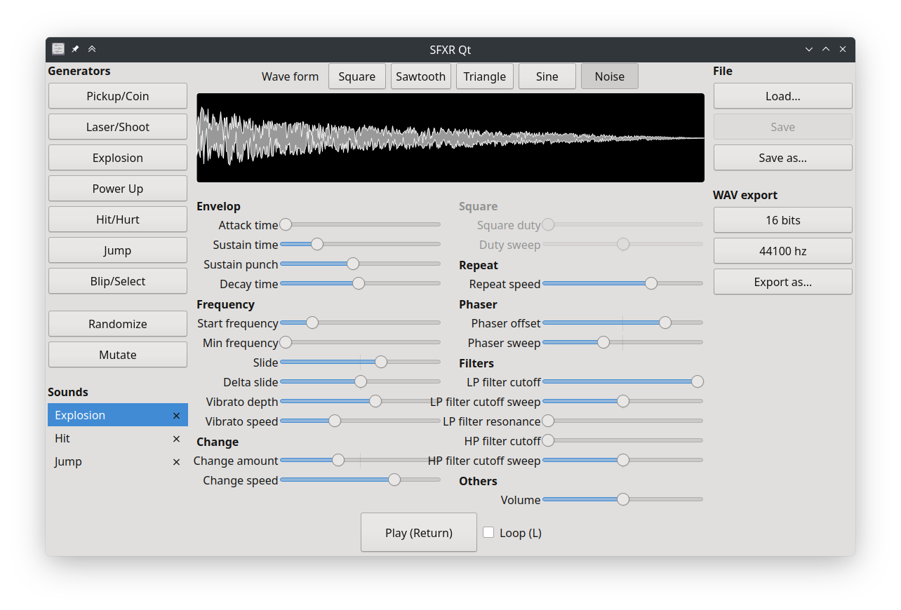

It's been a very long time since the last release of [SFXR-Qt][], my Qt port of SFXR retro sound effect generator.

A few bug reports have accumulated since then, as well as some build fixes, patiently waiting to see the day they would be released. It was time to blow the dust off this repository. I tackled a few of the bugs and wrapped version 1.5.1.

<!-- break -->

The changelog is quite short:

- Fixes:
    - Fix rendering of very short sounds ([#21][])
    - Fix 22.5 khz wav files being reported as truncated by some apps ([#22][])
- Internals:
    - Use system version of Catch2 (Matthias Mailänder)
    - Fix build failure (Alex Myczko)
    - Port to Catch2 3.4.0 (that one is a bit embarrassing: Catch2 is at 3.6.0 now 😅)

SFXR-Qt 1.5.1 is now available for download from [GitHub][release]. Get it and have fun generating blip, power up and explosion sounds!

[#21]: https://github.com/agateau/sfxr-qt/issues/21
[#22]: https://github.com/agateau/sfxr-qt/issues/22
[SFXR-Qt]: https://github.com/agateau/sfxr-qt
[release]: https://github.com/agateau/sfxr-qt/releases/1.5.1

