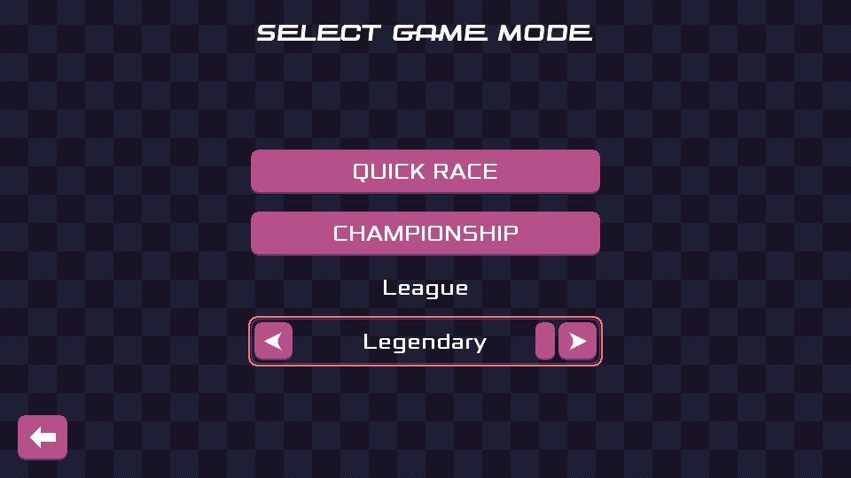

This is it! After way too long, the first release candidate of Pixel Wheels is out!

Let's see what's in the box.
<!-- break -->

## Difficulty levels

There are now 3 difficulty levels, called Leagues: Casual, Pro and Legendary. The main difference between them is how fast vehicles can drive.

"Legendary" is the speed at which vehicles were driving until now. "Pro" is slightly slower. "Casual" is the most approachable.

I hope this makes the game less frustrating for new players.

## Improved controls

Continuing on the topic of making the game nicer to play I adjusted steering, acceleration and turbo settings to make vehicles easier to control.

## A new vehicle

The game features a new vehicle: [the C15][c15]! Yet another unusual addition to Pixel Wheels eclectic roster :)

[c15]: /projects/pixelwheels/vehicles/#c15

## More unlocks

More vehicles now need to be unlocked: Ant On-1, Pickup, 2-deuch and Roadster. The game starts with only the Red Lightning and the Highway Patrol cars.

To find out how to unlock a vehicle, click on it in the selection screen. The description at the bottom of the screen tells you what to do.

## Get it

As usual, the game is waiting for you [on various platforms][get-it]!

[get-it]: /projects/pixelwheels/#get-it

## What's next?

The game is mostly finished at this point, the goal of this release candidate is to get feedback about the control tweaks and the different leagues: does it make the game more approachable? Do the max speeds need to be further tweaked?

Pending no critical bugs, 1.0.0 should be next, hopefully not too long after (famous last words!) and Pixel Wheels will finally be out of the "open testing" phase on Google Play.
