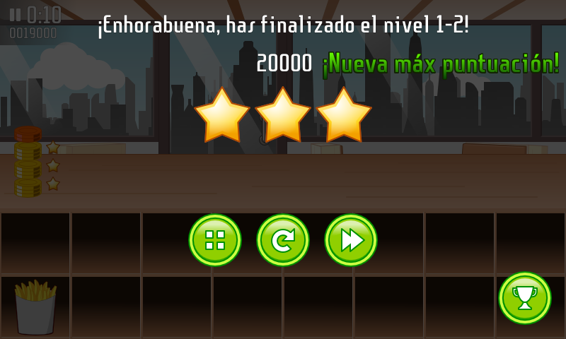

Today I released a small update for [Burger Party][bp]. Version 1.4.6 fixes an overflowing text in the Spanish translation by Miguel de Dios (This fix has been waiting to be released since December, sorry for that 😞) and prevents aggressive powersaving settings from putting the screen in sleep mode while playing ([bug #14][b14]).

_The Spanish translation for "New High Score!" now fits the screen._

<!-- break -->

Just looked at the [CHANGELOG.md][] and realized version 1.0 was released almost 12 years ago. Time flies!

[bp]: /projects/burgerparty
[b14]: https://github.com/agateau/burgerparty/issues/14
[CHANGELOG.md]: https://github.com/agateau/burgerparty/blob/master/CHANGELOG.md
