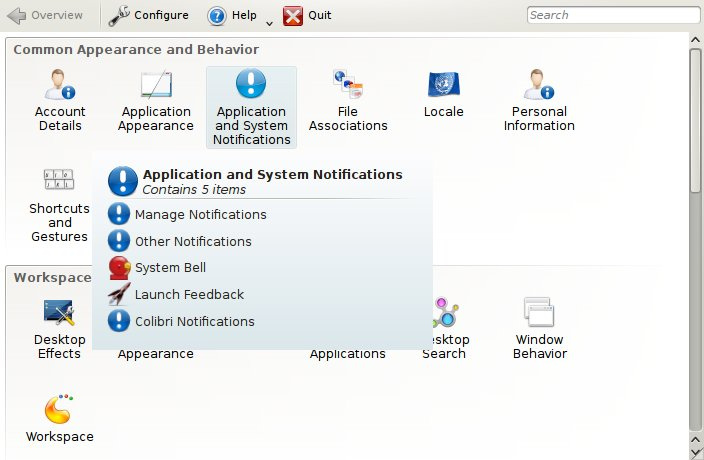
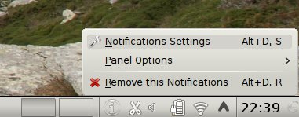
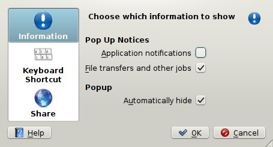
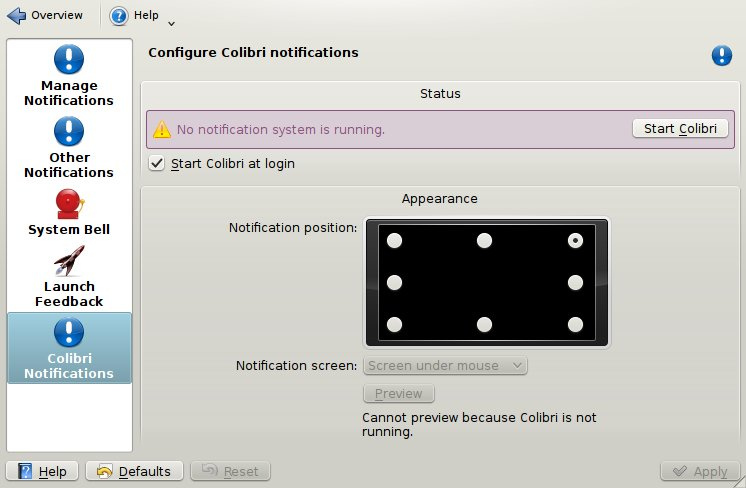
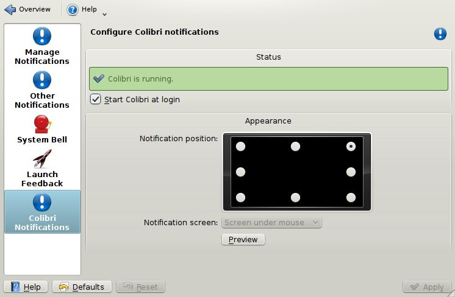

public: yes
tags: []
comments: false
title: Colibri Setup Guide
summary: Setup guide to configure Colibri on a KDE system

This guide will help you configure your KDE machine to use Colibri instead of
the default Plasma notifications.

## Introduction

Start System Settings and open "Application and System Notifications".

Go to "Colibri Notifications", notice the warning message. You must disable
Plasma notifications.

## Disabling Plasma notifications

Right-click on the (i) icon in the system tray.

Uncheck "Application notifications" and click OK.

## Enabling Colibri notifications

Go back to the System Settings window, the warning message should now look like
this.

Click the "Start Colibri" button, Colibri should now be running. You can verify
it with the "Preview" button.

Your machine is ready to use Colibri. Unless you unchecked "Start Colibri at
login", it should continue to use Colibri next time you login.
