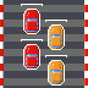

public: yes
tags: []
title: Tiny Wheels
disqus: false

Tiny Wheels is a top-down racing game for PC (Linux, Mac, Windows) and Android.

## Gallery

.. gallery::
    - full: 0.1/snow.png
      alt: Spreading havoc in the snow
    - full: 0.1/city.png
      alt: Going after an heavily armored roadster in the city
    - full: 0.2/hud.png
      alt: The new virtual buttons, and the turbo in action

## Get it

The game is far from finished, but you can already play with it.

### Download Tiny Wheels for Android

<a href="/storage/tinywheels/tinywheels-0.2.apk" class="dl-button">tinywheels-0.2.apk</a>

### Download Tiny Wheels for PC

<a href="/storage/tinywheels/tinywheels-0.2.tar.bz2" class="dl-button">tinywheels-0.2.tar.bz2</a>

(Requires a Java runtime)

## Bug reports

Found a bug? Report it on [Tiny Wheels bug tracker](http://github.com/agateau/tinywheels/issues).

<!--
<h2>Latest Tiny Wheels News</h2>

<% items_with_tag('tinywheels').sort{ |a,b| b[:created_at] <=> a[:created_at] }[0, 10].each do |item| %>
<h3><%= link_to item[:title], item.path %>
<%= item[:created_at].strftime('%B %d, %Y') %>
</h3>
<% end %>
</section>
-->
